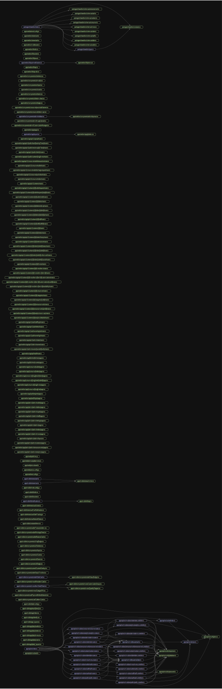

# Dependency Graph

**191 modules** with **102 connections**

## Most-Used Modules

These files are imported by the most other files — they are the backbone of the project:

| Module | Imported By |
|--------|------------|
| `apps/api/src/utils/response.ts` | 14 files |
| `apps/api/src/config/database.ts` | 12 files |
| `apps/api/src/middleware/auth.ts` | 10 files |
| `apps/api/src/middleware/validate.ts` | 9 files |
| `apps/api/src/config/env.ts` | 4 files |
| `apps/api/src/utils/jwt.ts` | 4 files |
| `apps/api/src/socket/index.ts` | 2 files |
| `apps/api/src/utils/password.ts` | 2 files |
| `apps/api/src/modules/order/order.controller.ts` | 2 files |
| `apps/mobile/stores/mmkv.ts` | 2 files |

## Circular Dependencies

None found.

## Orphan Modules

These files are not imported by anything else. They might be entry points, or they might be dead code:

- `apps/api/prisma/seed.ts`
- `apps/api/src/index.ts`
- `apps/mobile/app/(tabs)/_layout.tsx`
- `apps/mobile/app/(tabs)/cart.tsx`
- `apps/mobile/app/(tabs)/menu.tsx`
- `apps/mobile/app/(tabs)/orders.tsx`
- `apps/mobile/app/(tabs)/wallet.tsx`
- `apps/mobile/app/_layout.tsx`
- `apps/mobile/app/identify.tsx`
- `apps/mobile/app/index.tsx`
- `apps/mobile/app/track/[token].tsx`
- `apps/mobile/babel.config.js`
- `apps/mobile/components/cart/CartItemCard.tsx`
- `apps/mobile/components/cart/PaymentMethodSelector.tsx`
- `apps/mobile/components/menu/CategoryPill.tsx`
- `apps/mobile/components/menu/ItemDetailSheet.tsx`
- `apps/mobile/components/menu/MenuItemCard.tsx`
- `apps/mobile/components/order/OrderCard.tsx`
- `apps/mobile/components/order/StatusTimeline.tsx`
- `apps/mobile/components/scanner/ScannerOverlay.tsx`
- `apps/mobile/components/ui/Badge.tsx`
- `apps/mobile/components/ui/Button.tsx`
- `apps/mobile/components/ui/Card.tsx`
- `apps/mobile/components/ui/Input.tsx`
- `apps/mobile/components/ui/Skeleton.tsx`
- `apps/mobile/components/ui/VegBadge.tsx`
- `apps/mobile/components/wallet/BalanceCard.tsx`
- `apps/mobile/components/wallet/RechargeSheet.tsx`
- `apps/mobile/components/wallet/TransactionItem.tsx`
- `apps/mobile/constants/theme.ts`
- `apps/mobile/hooks/useNetworkStatus.ts`
- `apps/mobile/hooks/useOrderTracking.ts`
- `apps/mobile/hooks/usePushNotifications.ts`
- `apps/mobile/hooks/useSocket.ts`
- `apps/mobile/lib/notifications.ts`
- `apps/mobile/lib/socket.ts`
- `apps/mobile/lib/utils.ts`
- `apps/mobile/metro.config.js`
- `apps/mobile/stores/auth.ts`
- `apps/mobile/stores/cart.ts`
- `apps/web/next.config.js`
- `apps/web/postcss.config.js`
- `apps/web/prisma/seed.ts`
- `apps/web/prisma/update-menu.ts`
- `apps/web/public/sw.js`
- `apps/web/src/app/(admin)/admin/analytics/page.tsx`
- `apps/web/src/app/(admin)/admin/announcements/page.tsx`
- `apps/web/src/app/(admin)/admin/canteens/page.tsx`
- `apps/web/src/app/(admin)/admin/layout.tsx`
- `apps/web/src/app/(admin)/admin/menu/page.tsx`
- `apps/web/src/app/(admin)/admin/orders/page.tsx`
- `apps/web/src/app/(admin)/admin/page.tsx`
- `apps/web/src/app/(admin)/admin/settings/page.tsx`
- `apps/web/src/app/(admin)/admin/staff/page.tsx`
- `apps/web/src/app/(admin)/admin/super/page.tsx`
- `apps/web/src/app/(admin)/admin/tables/page.tsx`
- `apps/web/src/app/(admin)/admin/wallet/page.tsx`
- `apps/web/src/app/(auth)/login/page.tsx`
- `apps/web/src/app/(auth)/register/page.tsx`
- `apps/web/src/app/(consumer)/[slug]/cart/page.tsx`
- `apps/web/src/app/(consumer)/[slug]/menu/page.tsx`
- `apps/web/src/app/(consumer)/[slug]/order/[orderId]/page.tsx`
- `apps/web/src/app/(consumer)/[slug]/track/[token]/page.tsx`
- `apps/web/src/app/(consumer)/orders/page.tsx`
- `apps/web/src/app/(consumer)/wallet/page.tsx`
- `apps/web/src/app/(kitchen)/counter/page.tsx`
- `apps/web/src/app/(kitchen)/kitchen/page.tsx`
- `apps/web/src/app/api/health/route.ts`
- `apps/web/src/app/api/v1/admin/owners/[ownerId]/verify/route.ts`
- `apps/web/src/app/api/v1/admin/owners/route.ts`
- `apps/web/src/app/api/v1/admin/stats/route.ts`
- `apps/web/src/app/api/v1/auth/owner/login/route.ts`
- `apps/web/src/app/api/v1/auth/owner/register/route.ts`
- `apps/web/src/app/api/v1/auth/refresh/route.ts`
- `apps/web/src/app/api/v1/auth/staff/login/route.ts`
- `apps/web/src/app/api/v1/canteens/[id]/analytics/detailed/route.ts`
- `apps/web/src/app/api/v1/canteens/[id]/analytics/summary/route.ts`
- `apps/web/src/app/api/v1/canteens/[id]/announcements/[annId]/route.ts`
- `apps/web/src/app/api/v1/canteens/[id]/announcements/route.ts`
- `apps/web/src/app/api/v1/canteens/[id]/categories/[catId]/route.ts`
- `apps/web/src/app/api/v1/canteens/[id]/categories/route.ts`
- `apps/web/src/app/api/v1/canteens/[id]/consumers/route.ts`
- `apps/web/src/app/api/v1/canteens/[id]/menu/items/[itemId]/availability/route.ts`
- `apps/web/src/app/api/v1/canteens/[id]/menu/items/[itemId]/customizations/[custId]/route.ts`
- `apps/web/src/app/api/v1/canteens/[id]/menu/items/[itemId]/customizations/route.ts`
- `apps/web/src/app/api/v1/canteens/[id]/menu/items/[itemId]/route.ts`
- `apps/web/src/app/api/v1/canteens/[id]/menu/items/route.ts`
- `apps/web/src/app/api/v1/canteens/[id]/menu/route.ts`
- `apps/web/src/app/api/v1/canteens/[id]/orders/[orderId]/cancel/route.ts`
- `apps/web/src/app/api/v1/canteens/[id]/orders/[orderId]/collect-cash/route.ts`
- `apps/web/src/app/api/v1/canteens/[id]/orders/[orderId]/route.ts`
- `apps/web/src/app/api/v1/canteens/[id]/orders/[orderId]/status/route.ts`
- `apps/web/src/app/api/v1/canteens/[id]/orders/active/route.ts`
- `apps/web/src/app/api/v1/canteens/[id]/orders/history/route.ts`
- `apps/web/src/app/api/v1/canteens/[id]/orders/route.ts`
- `apps/web/src/app/api/v1/canteens/[id]/route.ts`
- `apps/web/src/app/api/v1/canteens/[id]/staff/[staffId]/route.ts`
- `apps/web/src/app/api/v1/canteens/[id]/staff/route.ts`
- `apps/web/src/app/api/v1/canteens/[id]/tables/[tableId]/qr/route.ts`
- `apps/web/src/app/api/v1/canteens/[id]/tables/[tableId]/route.ts`
- `apps/web/src/app/api/v1/canteens/[id]/tables/bulk-qr/route.ts`
- `apps/web/src/app/api/v1/canteens/[id]/tables/route.ts`
- `apps/web/src/app/api/v1/canteens/[id]/wallet/credit/route.ts`
- `apps/web/src/app/api/v1/canteens/[id]/wallet/requests/[reqId]/route.ts`
- `apps/web/src/app/api/v1/canteens/[id]/wallet/requests/route.ts`
- `apps/web/src/app/api/v1/canteens/route.ts`
- `apps/web/src/app/api/v1/consumer/orders/route.ts`
- `apps/web/src/app/api/v1/consumer/push-token/route.ts`
- `apps/web/src/app/api/v1/consumer/wallet/recharge-request/route.ts`
- `apps/web/src/app/api/v1/consumer/wallet/route.ts`
- `apps/web/src/app/api/v1/consumer/wallet/transactions/route.ts`
- `apps/web/src/app/api/v1/public/canteen/[slug]/menu/route.ts`
- `apps/web/src/app/api/v1/public/identify/route.ts`
- `apps/web/src/app/api/v1/public/resolve-qr/[qrToken]/route.ts`
- `apps/web/src/app/api/v1/public/track/[trackingToken]/route.ts`
- `apps/web/src/app/api/v1/upload/route.ts`
- `apps/web/src/app/layout.tsx`
- `apps/web/src/app/page.tsx`
- `apps/web/src/components/admin/CustomizationManager.tsx`
- `apps/web/src/components/admin/ImageUpload.tsx`
- `apps/web/src/components/admin/sidebar.tsx`
- `apps/web/src/components/consumer/bottom-nav.tsx`
- `apps/web/src/components/consumer/pwa-install-banner.tsx`
- `apps/web/src/components/ui/badge.tsx`
- `apps/web/src/components/ui/bottom-sheet.tsx`
- `apps/web/src/components/ui/button.tsx`
- `apps/web/src/components/ui/card.tsx`
- `apps/web/src/components/ui/input.tsx`
- `apps/web/src/components/ui/modal.tsx`
- `apps/web/src/components/ui/skeleton.tsx`
- `apps/web/src/lib/api-utils.ts`
- `apps/web/src/lib/api.ts`
- `apps/web/src/lib/push-notifications.ts`
- `apps/web/src/lib/pwa.ts`
- `apps/web/src/lib/socket.ts`
- `apps/web/src/lib/utils.ts`
- `apps/web/src/middleware.ts`
- `apps/web/src/stores/auth.ts`
- `apps/web/src/stores/cart.ts`
- `apps/web/tailwind.config.ts`
- `packages/shared/src/index.ts`

